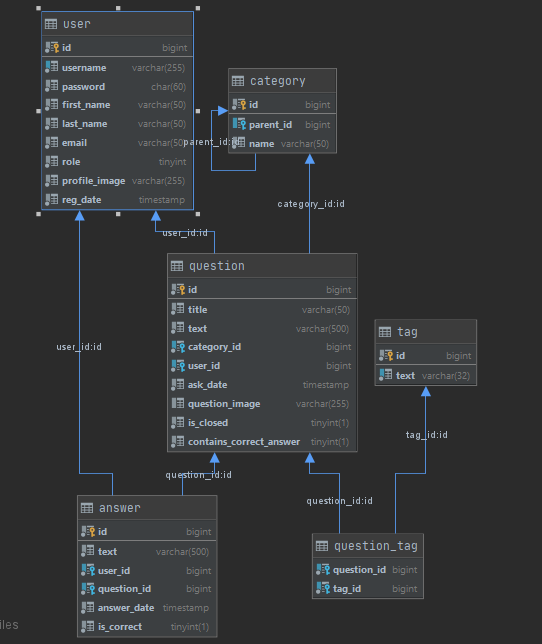

# Ask&Go

Форум вопрос-ответ по программированию.
 
####Техническое описание проекта:
- Java 8
- Контейнер сервлетов : `Apache Tomcat 9.0.39`
- База данных : `MySql 8`
- Для соеденения с БД : `JDBC`
- JavaEE `(Java Servlets, JSP)`
- Для расширения JSP используется `JSTL`
- Ведение логирования с помощью : `Log4J2`
- Фреймворк для тестирования : `TestNG`
- CSS/Javascript framework : `Bootstrap4`
- Для валидации на клиенте : `JavaScript`
- Для автоматизации сборки проекта : `Maven`

###Для развертывания проекта необходимо:
- Создать бд `askandgo_db`.
- Выполнить скрипты 2-4 из папки sql.
- подключить tomcat и запустить приложение.

 
В приложении выполнено разделение ролей. 

Каждая роль не дополняет предыдущую, а имеет свой, уникальный список возможностей.

####Список ролей:
- Администратор
- Mодератор
- Писатель
- Читатель

##### Возможности `Администратора`: 
- Добавлять категории
- Редактировать категории
- Удалять категории
- Менять другим юзерам роли

##### Возможности `Модератора`: 
- Удалять ответы/вопросы других пользователей
- Блокировать пользователям возможность задавать вопросы/писать ответы(Устанавливать роль читателя)

##### Возможности `Писателя`:
- Задавать вопросы
- Писать ответы
- Редактировать вопросы. 
- Редактировать ответы.
- Закрывать свой вопрос.
- Отмечать ответ на свой вопрос как верный.
- Удалять свой вопрос/ответ.

##### `Читатель`
- Лишен возможности добавлять какой либо контент, кроме своей персональной информации.

##### Общий функционал:
- Смена языка интерфейса
- Смена пароля 
- Смена персональной информации.

##### Не аутентифицированный пользователь:
- Менять язык интерфейса
- Просматривать категории на сайте
- Искать вопросы
- Лишен возможности просматривать вопросы для того чтобы сподвигнуть к регистрации.

UPD. Выполнена пагинация для просмотра страницы вопроса.

####Планируется:
- Пагинация для страницы администратора.
- Пагинация для поиска вопросов.
- Просмотр n последних вопросов.
- Поиск пользователей.
- Регистрация через email.

